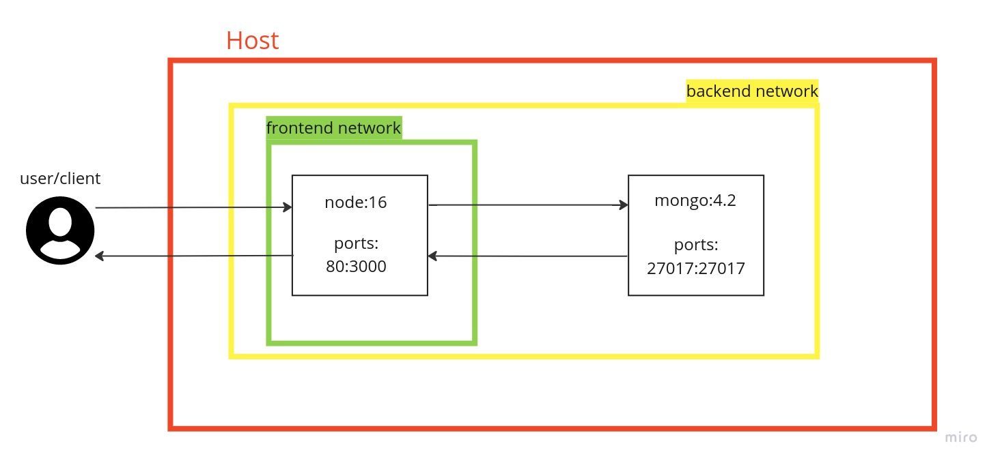

Counting how many apples are in my DB?
===

> Containerized serivces

This project launches a website that displays how many apples are in my DB?
That's a great question, although the real task in here is the use of containers.

> To execute the server:
- Pull the repo
- Write in the console "./installings.sh"
- Write again in the console "./run.sh"

Immediately, after downloading and installing all the dependencies, the web will show with accuracy, how many apples are in the DB,
even different kind of apples.

In order to really Indicate that it works, u can change the "init-db.js" file, which holds the dump for our DB, and notice the number of apples
in the web is changed accordingly.

As we can see in our topolpgy, the user, sends request to our web which is seperated to two different networks: frontend - for our web, backend - for both our web and DB, and the web sends the request to the DB via the backend network, and returns the query's result via the same network, and then the website sends it back to our user through the front network.
The port of the web's is external 80 (HTTP) and internal 3000, in the DB they are both 27017, and the network seperation is for extra security level.
